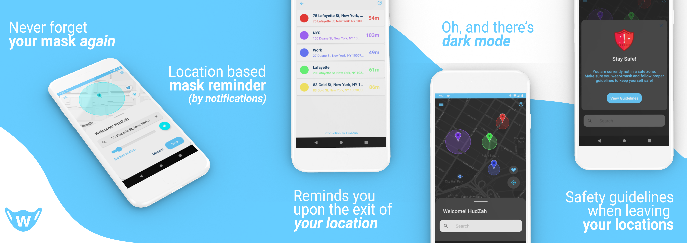

# What is wearAmask?
wearAmask is an app that allows you to add locations on a map and reminds you to wear your mask upon leaving a location. 

Users can add a location either by searching for an address or by long clicking on the add. When adding a new location, you can customize it by setting your own radius, color and name. 

When you leave a certain location, wearAmask sends you a high priority push notification that reminds you to wear a mask and follow safety guidelines. 

This notification will remind you to take your mask before you can even remind yourself! No more forgetting your mask at home and having to go all the way back just to get your mask.

You can download [wearAmask](https://play.google.com/store/apps/details?id=com.hudzah.wearamask) on Google Play

# How it works?

Using Geofencing technology, wearAmask is able to tell when you leave a location radius using your location settings, WiFi and bluetooth services to accurately determine when you leave/enter a location.

You can view all your locations in a single list in your "Locations" tab, allowing you to edit or delete a location.

wearAmask stores your locations locally on your device, we never send data to a server to protect your privacy.

# Other
Please note that this app is still in an alpha stage and is my second large android app since I started learning android developement at the start of this year :)
